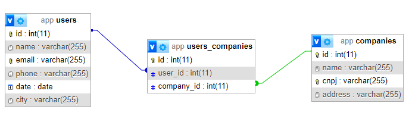

# API REST EM PHP 8.1

## ⚙️ O que é

Api REST utilizando php orientado a objetos com tipagem forte e arquitetura model, controller. Além dos models e controllers, para um maior desacoplamento da aplicação foi aplicado a variação do padrão singleton, chamada monostate (variação que não quebra os principios SOLID), na conexão com o banco de dados para garantir que não sejam abertas varias conexões.
Uma versão simplificada do padrão querybuilder foi utilizada para abstrair as querys do banco de dados e repositories foram criados para as regras de negócio.

## 📌 Tecnologias

- Git
- Docker
- PHP 8.1.0
- Composer 2
- Mysql 5.7
- phpmyadmin
- nginx
- Xdebug
- PHPCS
- PHPCS Fixer

- 📦 Pacotes:

    - vlucas/phpdotenv 5.5
    - phpunit/phpunit 10.0

## Conceitos implementados

- Models
- Controllers
- Routes
- Design Patterns (Singleton, Repository, Query Builder, Injeção de dependencia, Container Ioc, Front Controller)
- PHP: Constructor property promotion, named paramters, arrow functions, strict types, readonly
- Regex

## 📝 Entidades

A API contém as seguintes entidades e seus respectivos campos:

- Usuário
    - Nome: obrigatório para preenchimento
    - E-mail: obrigatório para preenchimento
    - Telefone: não obrigatório
    - Data de nascimento: não obrigatório
    - Cidade onde nasceu: não obrigatório
    - Empresas: obrigatório para preenchimento

- Empresa
    - Nome: obrigatório para preenchimento
    - CNPJ: obrigatório para preenchimento
    - Endereço: obrigatório para preenchimento
    - Usuários: obrigatório para preenchimento

A regra de relacionamento para `Usuário` e `Empresa` é  __n para n__

## Modelagem

### 🔶 Diagrama E.R.

### 🛢 Tabelas banco de dados



## 🏛️ Arquitetura

📦api-rest  
┣ 📂docker-compose  
┃ ┗ 📜k6-load-testing-results.json  
┣ 📂public  
┃ ┗ 📜img.png  
┣ 📂src  
┃ ┣ 📂Controllers  
┃ ┃ ┣ 📜login.request.js  
┃ ┃ ┣ 📜products.request.js  
┃ ┃ ┗ 📜users.request.js  
┃ ┣ 📂DB  
┃ ┃ ┣ 📜FullFlowLoad.test.js  
┃ ┃ ┗ 📜FullFlowStress.test.js 
┃ ┣ 📂Http 
┃ ┣ 📂Models 
┃ ┣ 📂Repositories 
┃ ┗ 📂Util  
┃ ┃ ┗ 📜utils.js 
┃ ┗ 📂config
┃ ┗ 📂routes
┣ 📂tests
┃ ┗ 📜img.png
┣ 📜.env-example 
┣ 📜.gitignore  
┣ 📜README.md  
┣ 📜90-xdebug.ini
┣ 📜Dockerfile
┣ 📜README.md
┣ 📜composer.json 
┣ 📜composer.lock
┣ 📜docker-compose.yml  
┣ 📜phpunit.xml

## 👨‍🏫 Tutorial de como rodar a aplicação:

### Softwares necessários

- 🐳 Docker
- 👾 Docker-Compose

#### Paso a passo

- Instalando

    - Se possui o git instalado:

        - Clone o repositório em: https://github.com/MatheusHonorato/php-projeto-pessoal

    - Se não possui o git instalado:

        - Acesse:  https://github.com/MatheusHonorato/php-projeto-pessoal

        - Clique em: CODE > Download ZIP

- Rodando a api

    Após efetuar o download do projeto é necessário executar os seguintes passos:

    - Habilite a instalação do seu docker;
    - Acesse a raiz do projeto e rode: 'docker run build' para fazer o build do arquivo Dockerfile;
    - Copie o arquivo `.env-example` e renomeie para `.env`;
    - Após o build rode o comando: 'docker-compose up -d' para subir os containers, rodar a aplicação e o script build para criar as tabelas no banco e inserir dados default;
    - Acesse o bash do container php com o comando: 
    ```bash docker exec -ti app``` e rode o comando: ```bash composer install``` para instalar as dependencias do projeto;
    - Aguarde alguns segundos e acesse o servidor da aplicação que estará disponível em: http://localhost:8000;
    - Se ocorrer algum erro rode ```bash docker-compose ps``` e verifique a coluna `State` de cada container, se alguma não estiver como `Up` provavelmente alguma porta já está sendo utilizada no sistema,
para resolver de forma rapida e conseguir testar a aplicação altere as portas utilizadas pelos containers no arquivo docker-compose.yml, rode ```bash docker-compose down``` e inicie o processo novamente.
    - A API pode ser testada de maneira isolada em softwares como o insomnia ou postman.

- Rodando testes

    Para rodar os testes é necessário acessar o container docker onde o php está sendo interpretado utilizando o seguinte comando: ```bash docker exec -ti app bash```. Em seguinda execute o comando ```bash vendor/bin/phpunit tests/``` para rodar os testes.

    Para verificar a cobertura dos testes passe a flag ```bash --coverage-text```

- Rodando PHPCS

    Para rodar o PHP CS acesse o container app como descrito anteriormente e então execute: ```bash php vendor/bin/phpcs src``` & ```bash php vendor/bin/phpcs public```

- Rodando PHPCBF

    Para rodar o PHP CS acesse o container app como descrito anteriormente e então execute: ```bash php vendor/bin/phpcbf src``` & ```bash php vendor/bin/phpcbf public```

- Rodando PHPCS Fixer

    Para rodar o PHP CS Fixer acesse o container app como descrito anteriormente e então execute: ```bash php vendor/bin/php-cs-fixer fix src``` & ```bash php vendor/bin/php-cs-fixer fix public```

# Rotas API:

## Companies

CompanyFind

    Método: GET

    Endereço: http://localhost:8000/companies/1

CompanyList

    Método: GET

    Endereço: http://localhost:8000/companies

CompanySearch

    Método: GET

    Endereço: http://localhost:8000/companies?name=empresa

CompanyCreate

    Método: POST

    Endereço: http://localhost:8000/companies

    JSON:

    {
        "name": "Empresa teste updaterrr",
        "cnpj": "12345600001",
        "address": "Rua exemplo",
        "user_ids": [1]
    }

CompanyUpdate

    Método: PUT

    Endereço: http://localhost:8000/companies/1

    JSON:

    {
        "name": "Empresa teste updaterrr",
        "cnpj": "12345600001",
        "address": "Rua exemplo",
        "user_ids": [1]
    }

CompanyDelete

    Método: DELETE

    Endeeço: http://localhost:8000/companies/1

## Users

UserFind

    Método: GET

    Endereço: http://localhost:8000/users/1

UserList

    Método: GET

    Endereço: http://localhost:8000/users

UserSearch

    Método: GET

    Endereço: http://localhost:8000/users?name=empresa

UserCreate

    Método: POST

    Endereço: http://localhost:8000/users

    JSON:

    {
        "name": "testek",
        "email": "testek@testekt.com",
        "date": "2020-05-05",
        "city": "moc",
        "phone": "3222222",
        "company_ids": [1]
    }

UserUpdate

    Método: PUT

    Endereço: http://localhost:8000/users/1

    JSON:

    {
        "name": "testek",
        "email": "testek@testekt.com",
        "date": "2020-05-05",
        "city": "moc",
        "phone": "3222222",
        "company_ids": [1]
    }

UserDelete

    Método: DELETE

    Endeeço: http://localhost:8000/users/1

## Refatorar

- Relacionamentos de associação (agregação) nas models
- Request.php v
- Validator.php
- QueryBuilder.php *********
- Exceções
- Segregar Contato de Pessoa
- Segregar Endereço de Pessoa
- Aplicar: https://github.com/MatheusHonorato/clean-code-php
- Terminar diagrama arquitetura
- Adicionar diagrama E.R.
- Adicionar diagrama de classes
- Revisar OWASP
- Testes unitários e de integração